# CreatorTracker

**Live at [creatorstracker.com](https://www.creatorstracker.com)** &nbsp;·&nbsp; Multi-platform creator analytics for influencer marketing teams.

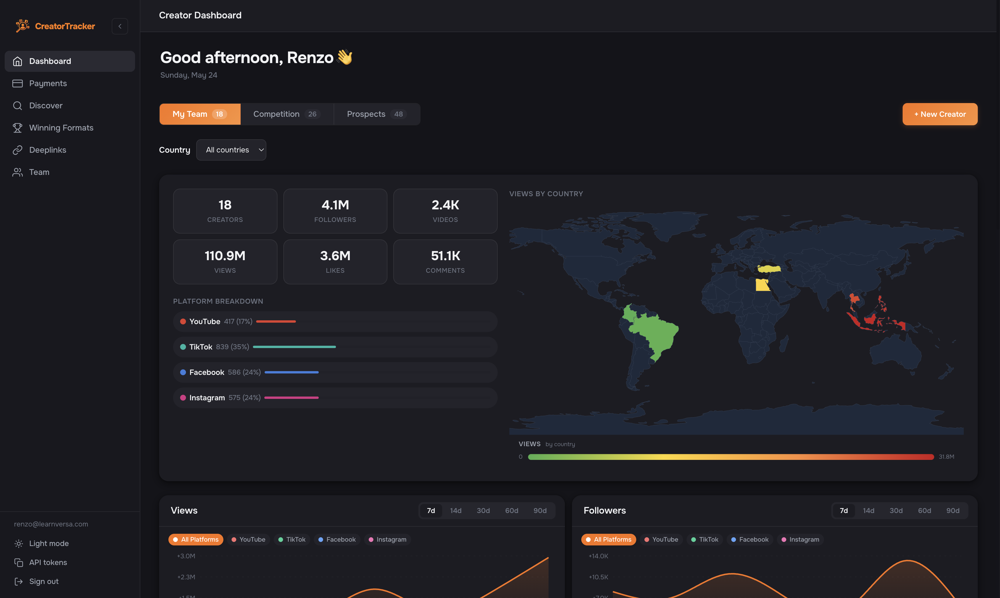

CreatorTracker is a multi-platform creator analytics platform that tracks the same creators across **TikTok, YouTube Shorts, Facebook Reels, and Instagram Reels** — pulling data with hourly refresh waves, scoring virality and conversion, surfacing breakout videos as they're happening, and operationalizing the contracts, payments, and discovery pipelines around them. It is a production SaaS used daily by the team at Versa.

> **Impact:** powered influencer marketing that helped acquire **300,000+ users with zero paid ad spend.**

---

## My role

I designed and built CreatorTracker as the founding engineer, taking it from 0→1 through production launch and the impact above. I architected and authored the core systems: the multi-platform data pipeline, scrapers across TikTok / YouTube / Facebook / Instagram, virality scoring, the discovery engine, the wave scheduler, auth, contracts + payments, and the dashboard analytics surface.

I have since handed the product off and no longer maintain it. The following capabilities were added post-handoff by the current team: **Deeplinks, Creator Portal, Winning Formats, Competitor Tracking, the Chrome Extension, Demo Workspaces, and the Ask AI assistant.**

---

## Features

- **Multi-platform tracking** — same creators across TikTok, YouTube Shorts, Facebook Reels, and Instagram Reels in a single dashboard
- **Virality scoring** — relative-velocity classifier benchmarking every video against the creator's own median, six tiers, peak-locking
- **Conversion scoring** — per-creator percentile-based tiers, gated by virality
- **Deeplinks** — multi-slug attribution per creator with clicks-over-time, hourly, and geographic breakdowns
- **Creator Discovery** — autonomous, quota-aware seed rotation against the YouTube API
- **Contracts, Payments & Tags** — per-video / monthly / weekly payment types, multi-currency (80+), actual-vs-expected reconciliation
- **Comparison** — side-by-side creator benchmarking
- **Creator Portal** — creator-facing view of their own performance
- **Competitor tracking** — separate roster, same metrics, dedicated Competition tab
- **Winning Formats** — high-performing videos saved as repeatable patterns, split by My team / Competitors
- **Ask AI** — natural-language Q&A over creator data, powered by Gemini 2.5 Flash with streaming responses
- **Promo detection** — auto-flag sponsored content via hashtag matching with sticky-true semantics
- **Team, roles, and permissions** — multi-user with Owner / Admin / Member roles
- **Target markets**, **Demo workspaces** (one-time scrape sandboxes for sales prospects), and a **Chrome extension**

---

## Dashboard

The agency's homepage. Six roster-wide KPIs alongside a **Views by Country** heatmap, with **My Team / Competition / Prospects** tabs for switching roster scope.

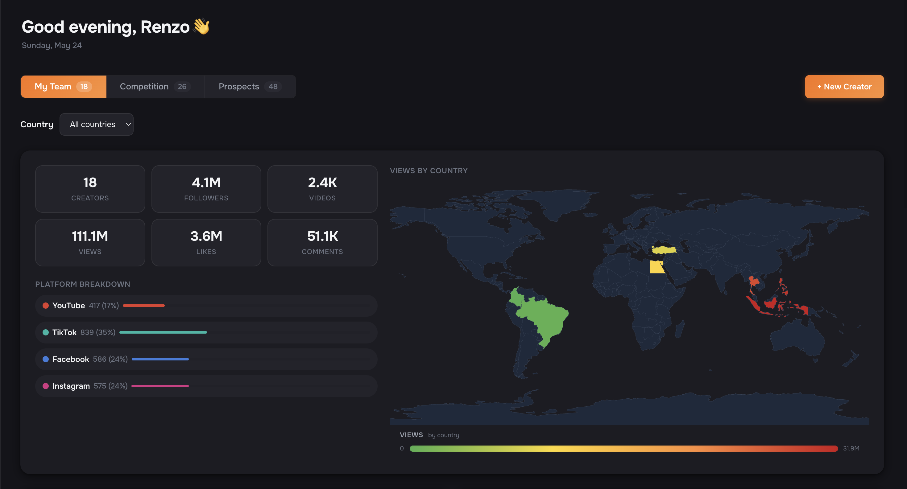

**Views** and **followers** over time, with per-day top-contributor attribution.

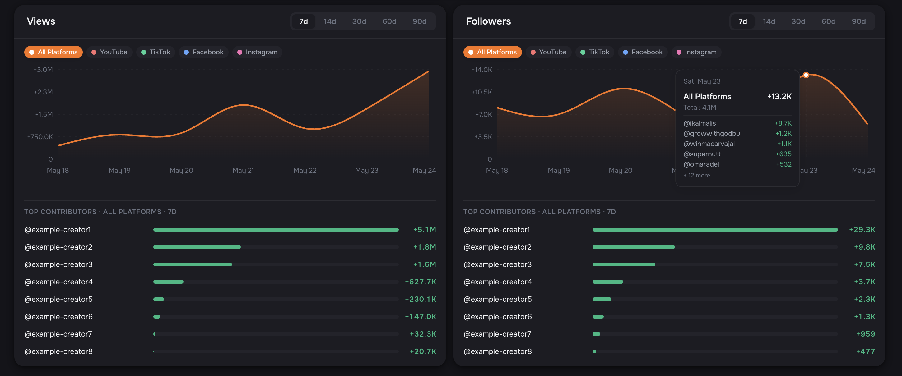

**Trending Viral** and **Top Converting** — the roster's hottest videos right now, ranked by tier.

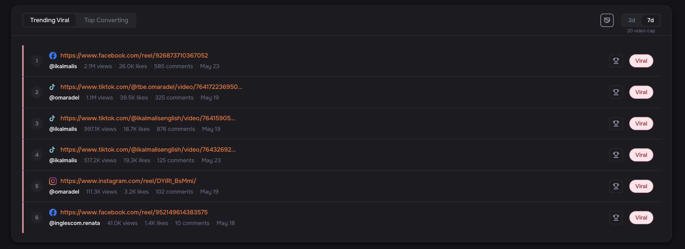

The **Creator Summaries** table — every creator's current state at a glance, with momentum and conversion tiers.

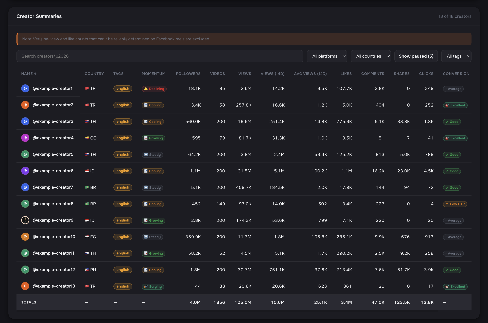

---

## Creator pages

Single-creator drill-in. Per-platform metric cards, **creator tags** (used to flag promoted videos under the contract), and a **Payment & Schedule** panel reconciling videos shipped vs. contract cadence.

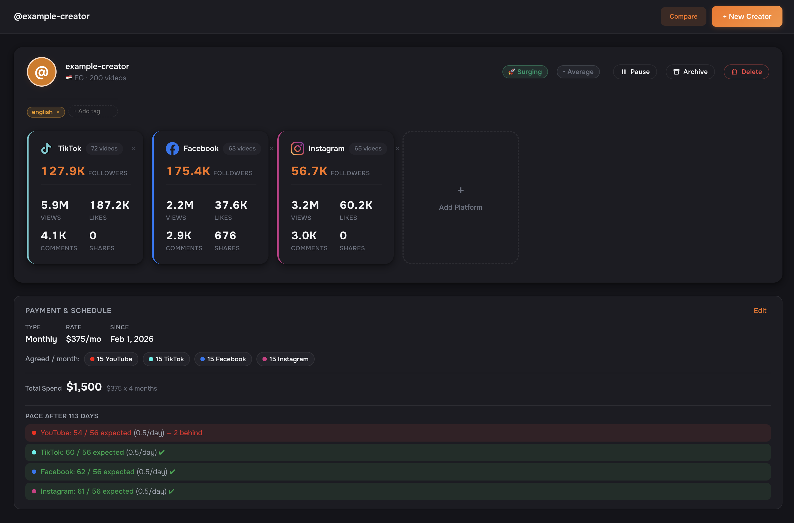

Per-creator views and followers over time, with **Ask AI** for natural-language Q&A over that creator's data. Powered by Gemini 2.5 Flash.

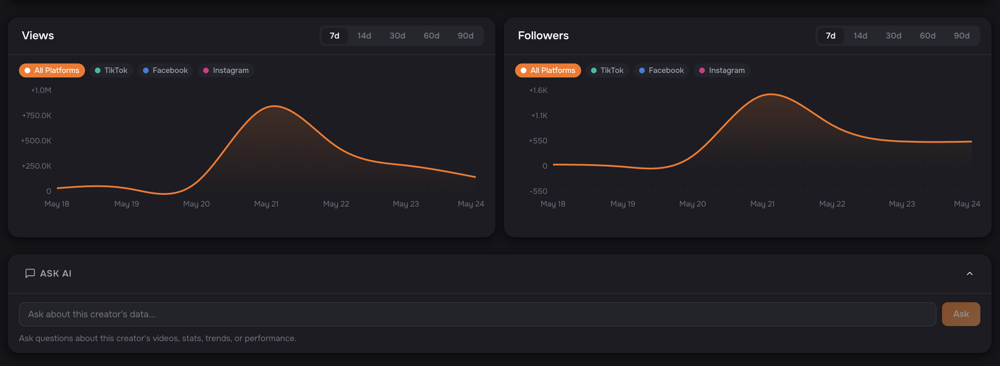

Every tracked video for the creator, refreshed hourly with per-row virality and conversion tiers and an expandable **Stats Over Time** chart.

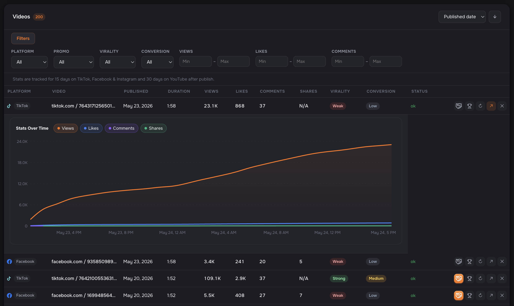

Lower on the page: per-creator **Deeplinks** (multi-slug, per-day click bars), **Contact** channels, and **Promos** configuration (manual override + auto-flag hashtag patterns).

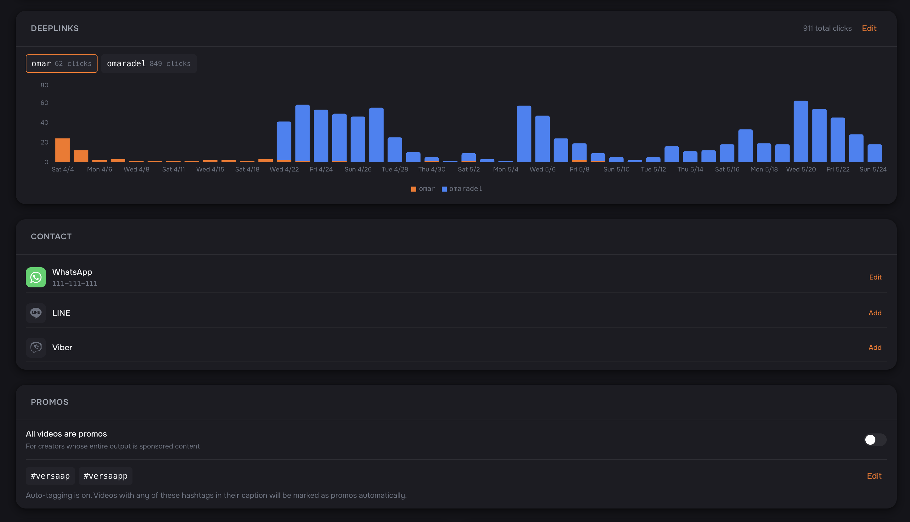

---

## Payments

Agency-wide payments view. Total spend, monthly rate, on-track-vs-behind status, and a **Salary Composition** bar breaking monthly spend by creator.

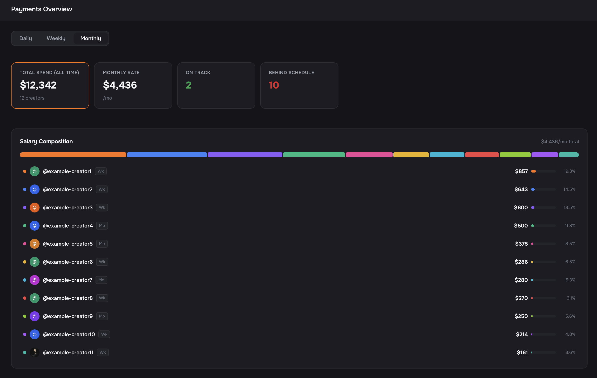

Every contract in one table — type, rate, spend, cost per click, and behind-schedule status. Multi-currency (80+) with live FX.

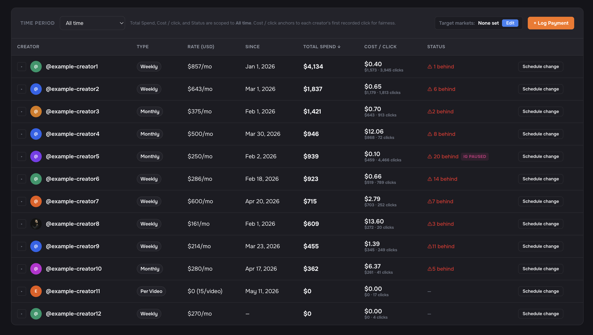

---

## Discover

Autonomous creator-acquisition. Candidates mined from **tag/keyword seeds and related channels** of the existing roster, scored on engagement and reach, surfaced for one-click add or dismiss.

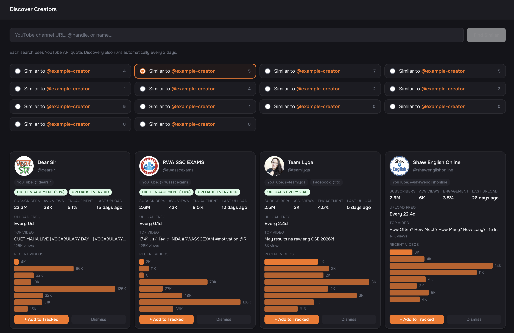

---

## Deeplinks

Aggregate attribution. Roster-wide totals and clicks-over-time stacked per-creator.

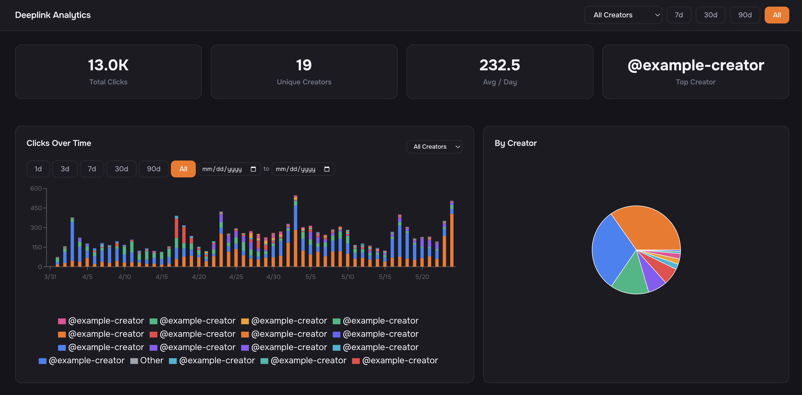

**Clicks by Hour** and **Click Geography** — when and where the clicks land.

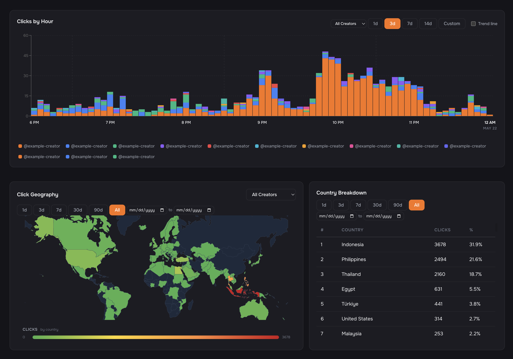

**Creator Breakdown** — every creator's click volume and share of total, time-period filterable.

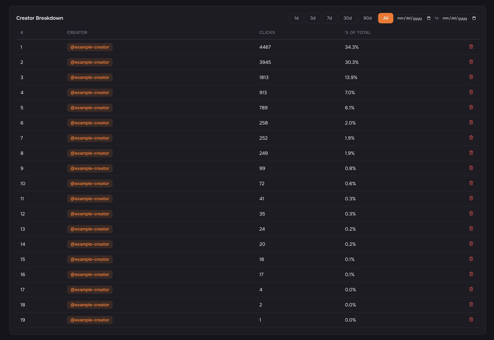

---

## Team

Multi-user workspace with an invite code and **Owner / Admin / Member** roles.

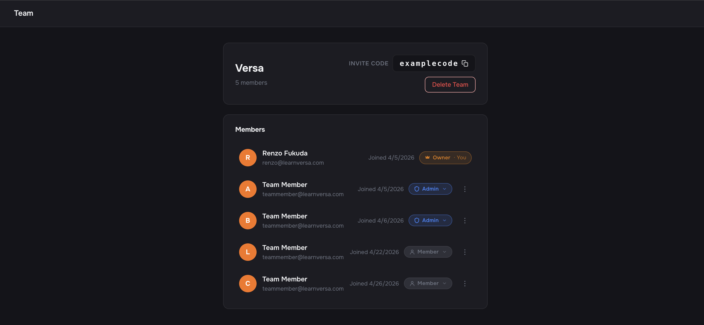

---

## Additional features

Features not shown in the screenshots above:

- **Comparison** — a side-by-side benchmarking view for any subset of the roster, with synchronized trend lines and per-platform breakdowns. Answers "is this creator outperforming the cohort, or is the whole niche heating up?" in one screen instead of clicking between individual creator pages. Pairs with **Ask AI** for head-to-head LLM Q&A between two creators.
- **Creator Portal** — a creator-facing dashboard that contracted creators log into to see a clean view of their own performance. Strips the agency-side tooling away and shows the creator only the data that's theirs.
- **Winning Formats** — high-performing videos saved as repeatable patterns the team can replicate. Any team member can flag a video as a template worth studying, and all flagged videos surface in a curated gallery — filterable by platform, sortable by performance, split by **My team / Competitors** so internal wins and external benchmarks stay distinct.
- **Demo workspaces** — sales-team one-time scrape demos for prospects, isolated from production data, so the sales team can show a real-looking version of CreatorTracker without exposing real creator rosters.
- **Chrome extension** — browser companion for the platform.
- **Target markets** — per-creator target-market tagging for regional reporting and filtering.

---

## Tech stack

| Layer        | Stack                                                        |
| ------------ | ------------------------------------------------------------ |
| **Backend**  | Python · FastAPI · APScheduler                               |
| **Database** | Supabase (PostgreSQL)                                        |
| **Scraping** | Selenium · yt-dlp · YouTube Data API v3 · instagrapi · Apify |
| **AI**       | Google Gemini 2.5 Flash via Vertex AI                        |
| **Frontend** | React 18 · TypeScript · Vite · Recharts · react-router-dom   |
| **Infra**    | Docker · Nginx · Let's Encrypt · Hetzner Cloud · Vercel      |

---

## Status

Live in production. Source code is private.

---

**Built by Renzo Fukuda.**
[renzof@stanford.edu](mailto:renzof@stanford.edu) &nbsp;·&nbsp; [LinkedIn](https://www.linkedin.com/in/renzo-kai-fukuda-54148a33b/)
